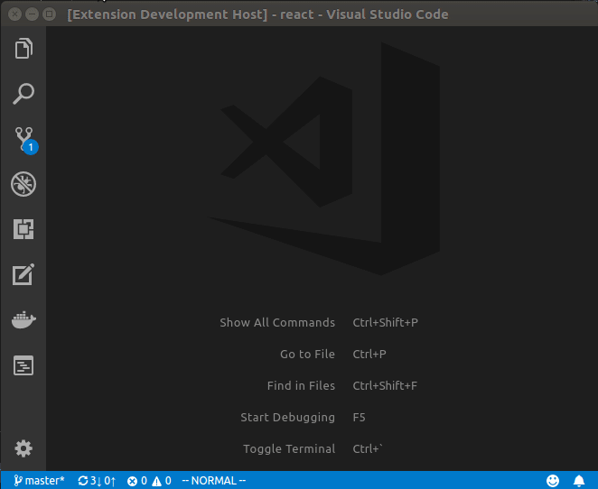

# NoteTree

NoteTree adds a new activity bar to VSCode that let's you browse, create, and edit notes from a variety of providers. So far, we have are able to mange notes from [MDJotter](http://mdjotter.com) and [Evernote](http://evernote.com).

## Features

* Connect to a variety of note providers
    * [MDJotter](http://mdjotter.com) (created by the developer of NoteTree)
    * [Evernote](http://evernote.com) (requires developer key from EverNote)
* Create new notes
* Organize your notes in folders
* Organize notes in sub-folders (not available in EverNote provider)
* Search notes (`ctrl + shift + p`, Search Notes)

## Extension Settings

### notetree.provider

This controls which provider you want to use. Currently, this must either be `mdjotter` or `evernote`.

### notetree.mdjotter.hostname

The hostname of the MDJotter server. This defaults to [http://mdjotter.com](http://mdjotter.com).

### notetree.mdjotter.port

The port that the MDJotter API is hosted on. This defaults to `3000`.

### notetree.mdjotter.username

The username of the MDJotter user

### notetree.mdjotter.password

The password for the MDJotter user

### notetree.evernote.apiKey

Your Evernote developer token. Note that you must manually request for an Evernote developer token these days. [See this thread](https://discussion.evernote.com/topic/113349-developer-token-requests/) for more information on how to aquire one.

## Known Issues

MDJotter doesn't support api keys yet, but will soon enough so you don't need to store your credentials in your configuration.